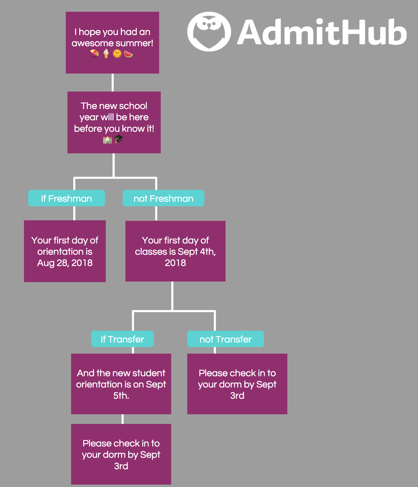

# Exercise 1

Given the following multi-message "Dialog", how would you represent this in a programming language of your choice?




# Exercise 2

Using your representation from **Exercise 1**, write a function that takes as parameters a `Dialog` and a `User` object and returns the `number` of messages sent to the user.

```
func messages_sent_to(user: User, dialog: Dialog) -> number
```

The User class has the following relevant attributes:

 - `school_year`: a string or enum containing FRESHMAN, SOPHMORE, JUNIOR, SENIOR
 - `is_transfer`: a boolean that's `true` for transfer students
 - `current_state`: a reference (e.g., pointer, numeric id, etc.) to a specific `State` object in a `Dialog`
 
 Assume the user starts off at the upper most state in the `Dialog` tree.
 
 ```
 User = {
   school_year: 'FRESHMAN' | 'SOPHMORE' | 'JUNIOR' | 'SENIOR'
   is_transfer: boolean
   current_state: ref State
 }
 ```
